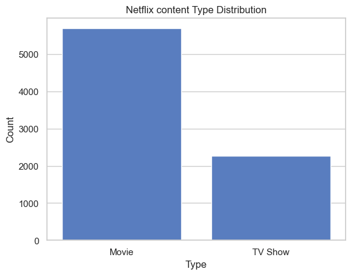
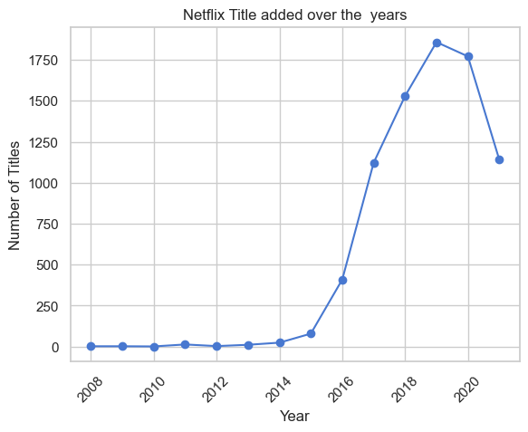
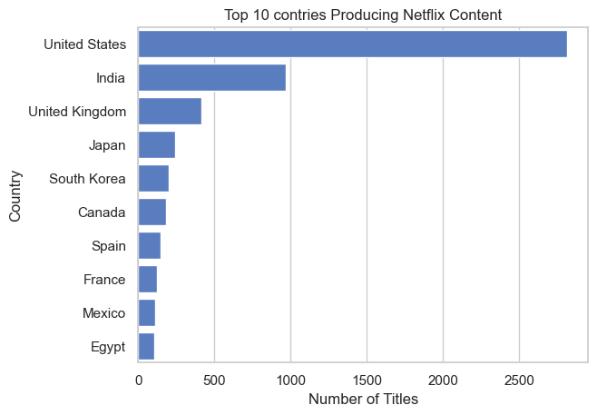

# 📺 Netflix Data Analysis (EDA Project)

This project explores Netflix’s content catalog using a publicly available dataset. We perform **Exploratory Data Analysis (EDA)** to uncover trends in content type, release patterns, ratings, genres, and more.

---

## 📊 Features & Questions Answered

- 📌 How much of Netflix is Movies vs TV Shows?
- 🌍 Which countries contribute the most content?
- 📅 How has content addition changed over the years?
- 🎭 What genres dominate Netflix?
- 🔞 What are the most common content ratings?

---

## 🧰 Tools Used

- [Python 3.8+](https://www.python.org/)
- [pandas](https://pandas.pydata.org/)
- [matplotlib](https://matplotlib.org/)
- [seaborn](https://seaborn.pydata.org/)
- [Jupyter Notebook](https://jupyter.org/)

---

## 📁 Folder Structure


```
netflix-data-analysis/
├── dataset/
│ └── netflix_titles.csv
├── Netflix_data_analysis.ipynb
├── Requirements.txt
└── README.md
```

---

## 📦 Installation

### 1. Clone this repository:

📂 GitHub Repo: [https://github.com/madhav-0000/Netflix_Data_Analysis](https://github.com/madhav-0000/Netflix_Data_Analysis)

```bash
git clone https://github.com/madhav-0000/Netflix_Data_Analysis.git
cd Netflix_Data_Analysis
```

### 2. Install dependencies:
```
pip install -r requirements.txt
```

### 3. Launch the notebook:
```
jupyter notebook
```

---

## 📂 Dataset

Dataset used: netflix_titles.csv  
Source: Netflix Movies and TV Shows on Kaggle 

---

## 📷 Sample Visualizations

<table>
  <tr>
    <td align="center">
      <br>
      <strong>Movies vs TV Shows</strong>
    </td>
    <td align="center">
      <br>
      <strong>Content Over Years</strong>
    </td>
    <td align="center">
      <br>
      <strong>Top Countries</strong>
    </td>
  </tr>
</table>

---


## 📌 Key Insight

- Netflix aggressively expanded its content between 2015 and 2019.  
- A sharp drop in 2020–2021 likely reflects the COVID-19 pandemic’s disruption to content production.

---

## 💡 What I Learned
- Data cleaning using pandas  
- Visualizing insights with matplotlib & seaborn  
- Extracting trends from real-world datasets  
- Structuring and presenting a professional EDA project on GitHub

---

## 👨‍💻 Author
### Madhav Gaba
Made with ❤️ during my data learning journey.  
Open to suggestions, improvements, and forks!

 
